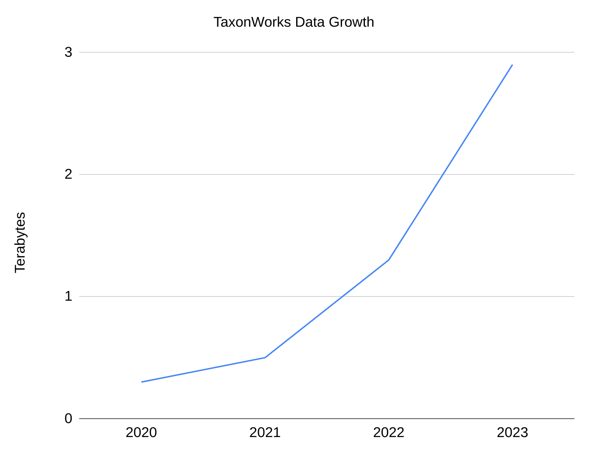

D. Mozzherin, H. Pereira, M. Yoder, D. Paul

# Dealing with an Exponential Data Growth

-----

## Summary

The Species File Group (SFG) at INHS is experiencing rapid growth in the amount of data their collaborators are adding to TaxonWorks.
Moving or backing up 6 million files with a total size of about 3TB has become slow, and the risk of losing data integrity has grown high.
To address these challenges and automate the process of system administration, the SFG team used several open-source solutions, including OpenZFS, Kubernetes, and Ansible.

----

The [Species File Group (SFG)](https://speciesfilegroup.org/) at INHS is at the heart of several efforts that provide services for the global biodiversity community.  These include TaxonWorks, Catalogue of Life, and GlobalNames.
[TaxonWorks](https://taxonworks.org/) offers a powerful workbench to taxonomists, biodiversity scientists, and collection managers who collectively describe life on Earth. The [Catalogue of Life](https://www.catalogueoflife.org/) provides the most rigorous checklist of the Earth's species available, we are key to its editing and data-pipeline management.
[Global Names](https://globalnames.org/) creates fast and flexible tools for the parsing, detecting, and resolving of scientific names, and powers up the [Biodiversity Heritage Library](https://www.biodiversitylibrary.org)'s name index.

TaxonWorks serves as the cornerstone project of our group. It is a 3rd generation tool developed by combining the decades of experience behind the expertise of three precursor taxonomic editorial tools: Species Files, MX, and 3i.
All of them were developed by members of the SFG.
Maturing quickly, the TaxonWorks project is experiencing an _exponential growth of data_.

As of February 2023, TaxonWorks already contained 3 TB of data and 6 million files (see graph).

Managing such large amounts of data has become increasingly difficult for us.
For example, it would take 5 days to transfer our total data from one computer to another. Making incremental backups would take up to 3 hours.
With these insights, we knew we must thoughtfully evaluate our current needs and methods for caring for this information and knowledge in the short and longer-term.
We concluded that the group is at risk of losing the integrity of the accumulated data in case of human error, hardware failure, or a disaster at the data center that houses our machines.
To address the growth rate and risks noted, we decided to rethink our strategy and provide technical solutions that would allow us to experience a 10-100 fold increase in efficiency.

Historically, our group lacks a full-time system administrator, and this role is distributed between several developers.
Currently, we run about 50 remotely accessed services on more than 10 computers.
Without a designated system administrator we needed a system that would allow us to maintain high day-to-day availability while minimizing human effort.

Our immediate goals were to:

- achieve fast and reliable integrity checks of all the data
- be able to efficiently and reliably transfer TaxonWorks files to a new production server or a backup
- distribute backups to several off-site locations to mitigate risks of technological or natural disasters
- realize fast disaster recovery in case of such misfortunes
- ensure high availability of day-to-day operations with minimal involvement in system maintenance

To achieve these goals, the group acquired dedicated storage hardware, namely DELL's MD1400 for production and ME4012 for backup.
Both systems, in their current configuration, allow them to scale their storage up to 70TB.
In addition to hardware, we also needed a new software solution to be able to reliably work with our increasing data.
We chose to use the [Open ZFS file system](https://openzfs.org/wiki/Main_Page) for all our production and backup needs.

ZFS provided us with several very important features.
The file system checks integrity of every stored byte, and can detect and repair even the smallest data corruption resulting from cosmic rays or a disk failure.
The speed of data transfer increased more than ten-fold, allowing us to copy 3TB in about 4 hours.
The speed of incremental backups increased hundred-fold, allowing us to send incremental changes in a matter of seconds.
Fast incremental backups now allow us to sync data remotely quickly, even if the remote place has slow internet.

To achieve high availability of our services and still keep system management within working hours and with only 1-2 hours/week system administration involvement, we automated our workflow.
We used [Ansible](https://www.ansible.com/) infrastructure automation tool and [Kubernetes](https://kubernetes.io/) computer cluster management as our two main software components.
We used the Git revision control system to distribute Ansible environments between system administrators.
With most of the infrastructure construction tasks automated, the group saved time and resources.

A Kubernetes cluster automates the maintenance of our services and ensures high availability for our users.
It monitors the services and restores them automatically if they break.
Kubernetes also has self-healing capabilities, so if the system itself experiences issues, it fixes them automatically.

For over five years, we have utilized Kubernetes and Ansible, which have significantly streamlined the deployment of our services.
This automated workflow has provided us with a flexible and user-friendly environment to make changes in our system, freeing up our time for projects' development.
We note that what we accomplished, without a dedicated system's administrator, requires a team approach _and_ top level people capable of multiple technical roles.
Relaying the skills and knowledge behind these activities forward to our future selves, replacements, and administrators is a major challenge, one we hope to address in part by documenting efforts like this.

Our group generates exclusively Open Sourced projects, and for system software we also prefer such solutions.
All described above tools are released as Open Source.

Now that we have achieved our goals, we plan to increase data safety in the future.
One major problem with computer technology is its volatility.
Storage hardware solutions degrade over time and may become technologically obsolete.
As a result, it is essential to actively transfer data to keep it alive.
The data about species and taxonomy we and our collaborators are producing are critical for future generations.
So, how can we preserve this perishable data for science?

Printing press technology gave us access to biodiversity information published 250 years ago by Carl Linnaeus.
However, the massive and increasing scale of today's data makes it impossible to publish as dead tree books.
The taxonomic data we accumulate now needs to be accessible 250 years from now, fully integrated in the science of the researchers and collections they serve then.
We hope that the workflows and approaches we develop now, with an open-science approach at their core, will enable the knowledge we currently produce to be accessible in the centuries that follow.
